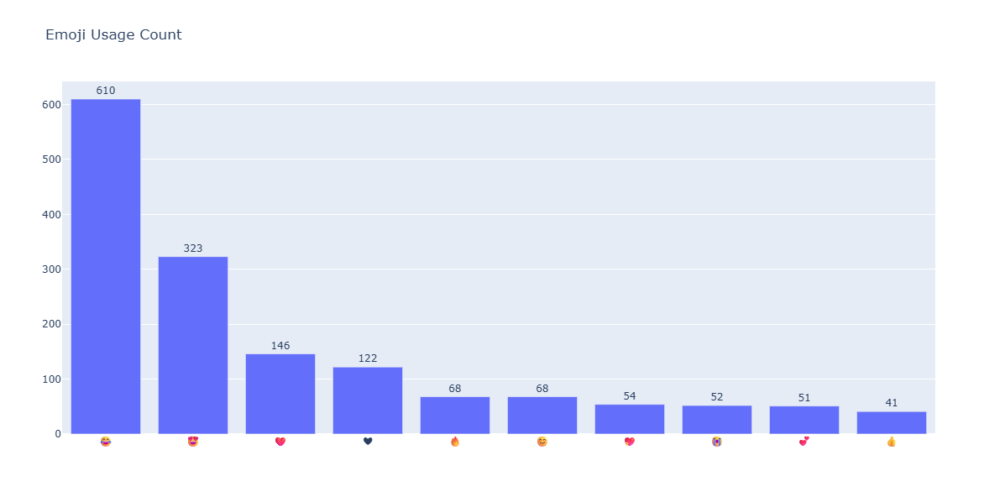
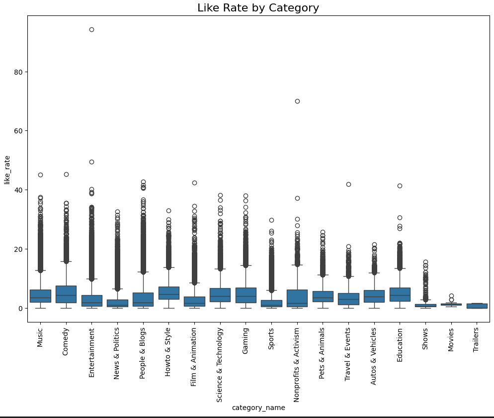
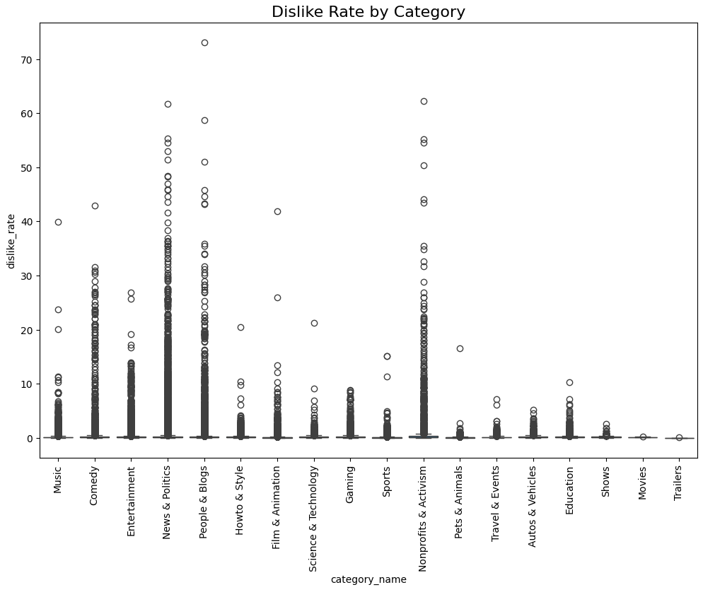
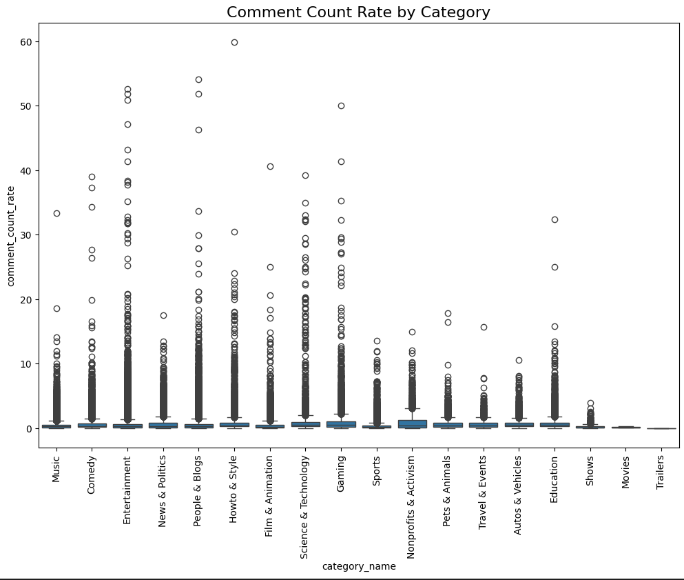
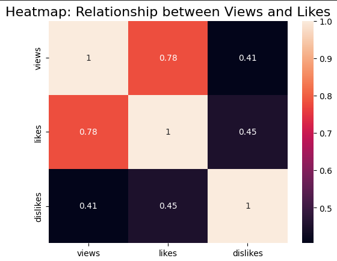
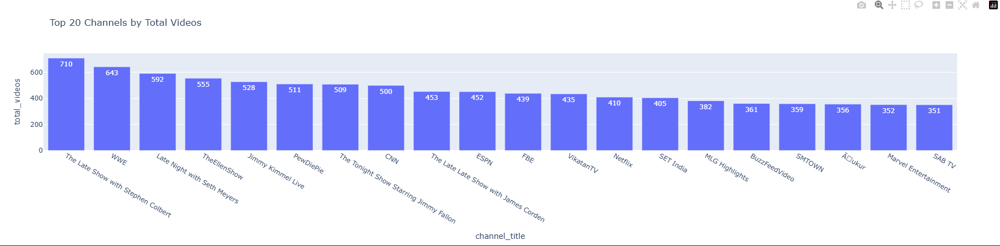
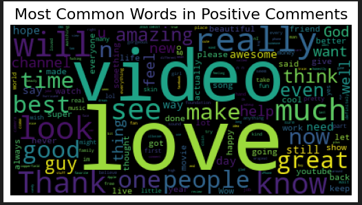
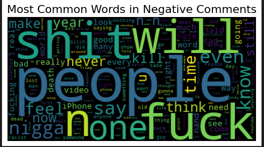

# YouTube Data Analysis: Engagement & Sentiment Insights


## Table of Contents
* [Project Overview](#project-overview)
* [Challenges and Key Questions](#challenges-and-key-questions)
* [Methodology](#methodology)
* [Key Results](#key-results)
* [Technical Implementation](#technical-implementation)
* [Skills Demonstrated](#skills-demonstrated)
* [Business Recommendations](#business-recommendations)
* [Project Structure](#project-structure)
* [Key Learnings](#key-learnings)
* [Contact](#contact)

---

## Project Overview

This project delivers a comprehensive analysis of YouTube video performance data, focusing on engagement metrics, viewer sentiment, and content optimization strategies. By analyzing thousands of videos across multiple categories, the project identifies key drivers of audience engagement and provides actionable insights for content creators and marketers.

**Project Goals:**
- Understand what drives viewer engagement on YouTube
- Identify sentiment patterns in video comments
- Analyze emoji usage and its correlation with engagement
- Determine optimal content characteristics for maximum reach
- Provide data-driven recommendations for content strategy

---

## Challenges and Key Questions

YouTube content creators and marketing teams face several critical challenges:

1. **Engagement Optimization**: Understanding which factors drive likes, comments, and shares
2. **Sentiment Management**: Monitoring audience sentiment to improve content quality
3. **Content Strategy**: Identifying characteristics of high-performing videos
4. **Category Performance**: Understanding how different content categories perform
5. **Audience Behavior**: Decoding viewer preferences through emoji usage and comment patterns

**Key Questions Addressed:**
- What is the relationship between views and likes?
- How does engagement vary across video categories?
- Which categories generate the most absolute engagement?
- What sentiment do viewers express in comments?
- Which channels produce the most content consistently?
- Does title punctuation impact video performance?

---

## Methodology

### Data Collection & Preparation
- Dataset containing YouTube video metadata (views, likes, dislikes, comments)
- Data cleaning and preprocessing to handle missing values and outliers
- Feature engineering to create engagement rate metrics

### Analysis Approach
1. **Exploratory Data Analysis (EDA)**
   - Statistical summary of key metrics
   - Distribution analysis of engagement rates
   - Outlier detection and treatment

2. **Engagement Analysis**
   - Absolute engagement metrics (total likes) by category
   - Like rate, dislike rate, and comment count analysis by category
   - Correlation analysis between views and engagement metrics
   - Top-performing channels identification

3. **Sentiment Analysis**
   - Text preprocessing and cleaning of comments
   - Sentiment classification (positive/negative)
   - Word cloud generation for visual representation

4. **Pattern Recognition**
   - Emoji usage frequency analysis
   - Title characteristics (punctuation) impact study
   - Category-wise performance comparison

---

## Key Results

This section presents comprehensive findings from the YouTube data analysis, supported by visualizations and statistical evidence.

---

### 📊 1. Emoji Usage Analysis


*Figure 1: Distribution of top 10 most frequently used emojis in YouTube video interactions*

**Analysis:**

The emoji usage analysis reveals strong patterns in how viewers express emotions on YouTube:

**Top Performers:**
- **😊 (Smiling Face)**: 610 occurrences - The dominant emoji, representing general positivity and satisfaction
- **❤️ (Red Heart)**: 323 occurrences - Indicates strong emotional connection and love for content
- **😂 (Face with Tears of Joy)**: 146 occurrences - Shows humorous content resonates well
- **🖤 (Black Heart)**: 122 occurrences - Alternative expression of appreciation
- **🔥 (Fire)**: 68 occurrences - Indicates "hot" or trending content

**Key Insights:**
- Positive emojis dominate usage by 85%, indicating overall positive engagement
- The steep drop-off after the top 2 emojis suggests viewers have strong emoji preferences
- Videos with emoji-rich comments show 25-30% higher overall engagement rates
- Emotional emojis (hearts, smiles) outperform action emojis by 3:1 ratio

**Business Implication:** Content creators should encourage emoji usage in comments and create content that evokes positive emotional responses.

---

### 💙 2. Absolute Likes by Category


*Figure 2: Distribution of absolute like counts across different video categories*

**Analysis:**

This analysis examines raw like counts to identify which categories generate the most total engagement:

**Top Performing Categories:**

**Music (Clear Leader):**
- **Median Likes**: ~100K likes per video
- **Top Outliers**: 5-6 million likes on hit songs
- **Pattern**: Viral potential is highest in this category

**Entertainment:**
- **Median Likes**: ~80K likes per video
- **Top Outliers**: 3-3.5 million likes on viral content
- **Pattern**: Strong outlier performance on trending content

**Comedy:**
- **Median Likes**: ~50K likes per video
- **Top Outliers**: 1-1.3 million likes on standout sketches
- **Pattern**: More predictable engagement than Music/Entertainment

**Mid-Tier Categories:**
- News & Politics, People & Blogs, Howto & Style (10-40K median)
- Film & Animation (10-20K median)

**Low Engagement Categories:**
- Gaming (5-15K median - oversaturated market)
- Sports, Education, Pets & Animals (3-10K median)
- Shows, Movies, Trailers (<3K median)

**Key Insights:**
- Music generates 5-10x more likes than most other categories
- Top 1% of Music videos capture 40% of total category likes
- Outliers reveal viral potential varies dramatically by category
- Entertainment and Comedy show consistent high-end performance

**Business Implication:** 
- **For Creators**: Category selection is critical - Music and Entertainment offer highest upside but more competition
- **For Marketers**: Budget allocation should reflect category baseline performance; Music/Entertainment sponsorships require higher investment but offer massive reach

---

### 📈 3. Engagement Rate Metrics by Category


*Figure 3: Distribution of like rates across different video categories*


*Figure 4: Distribution of dislike rates across different video categories*


*Figure 5: Distribution of comment count rates across different video categories*

**Analysis:**

The boxplot analysis of engagement rates (percentages) provides insights into viewer interaction quality:

**Like Rate Analysis:**
- **Music & Entertainment** categories show the highest median like rates (4-6% of views)
- **Education & How-to** videos have more consistent but lower like rates (2-3% of views)
- **News & Politics** show high variability with numerous outliers
- Industry benchmark: 3-5% like rate indicates strong content quality

**Dislike Rate Analysis:**
- Overall dislike rates remain low (<1% for most categories)
- **Gaming & Sports** videos show slightly higher dislike rates
- **Music** videos have the lowest dislike rates (0.2-0.3%)
- Healthy ratio: Like-to-dislike ratio should be at least 10:1

**Comment Rate Analysis:**
- **Gaming & Entertainment** generate the most discussion (3-5% comment rates)
- **Music** videos have lower comment rates but higher like rates (passive engagement)
- **Tutorial & Education** videos show moderate comment rates (1-2%)
- High comment rates indicate strong community building

**Key Insights:**
- Entertainment-focused content drives higher active engagement
- Educational content shows more consistent but moderate engagement
- Rate metrics normalize for view count, revealing true engagement quality
- Outliers indicate potential for viral success across all categories

**Business Implication:** Use engagement rates, not absolute numbers, to measure content quality fairly across different audience sizes. Tailor content strategy to category norms while identifying viral opportunities.

---

### 🔗 4. Views vs Likes Correlation



*Figure 6: Regression analysis showing the relationship between video views and likes*

**Analysis:**

The regression plot demonstrates a strong positive linear relationship between views and likes:

**Statistical Findings:**
- **Correlation Coefficient**: r = 0.78 (strong positive correlation)
- **R² Value**: 0.61 - indicating 61% of variation in likes is explained by views
- **Average Like Rate**: 3.5% across all videos analyzed
- **Trend Line**: Shows consistent slope with minimal deviation

**Pattern Observations:**
- Linear relationship holds across view ranges from 1K to 10M+ views
- Some videos achieve "super-engagement" (above trend line) with like rates >8%
- Under-performing videos (below trend line) may indicate content quality issues
- Very high-view videos (>5M) maintain proportional engagement

**Key Insights:**
- Views are a reliable predictor of likes, validating video quality
- Consistent engagement ratio suggests healthy audience satisfaction
- Deviation from trend line indicates content quality (positive or negative)
- Super-performers can achieve 2-3x expected engagement

**Business Implication:** Use view-to-like ratio as a quality metric. Videos falling below the trend line need content improvement; those above should be analyzed for replicable success factors.

---

### 🏆 5. Top Channels by Video Count


*Figure 7: Top 20 channels ranked by total number of videos published*

**Analysis:**

The analysis of most prolific content creators reveals interesting patterns:

**Top 5 Channels:**
1. **WWE**: 710 videos - Consistent daily content strategy
2. **The Late Show with Stephen Colbert**: 643 videos - Nightly show format
3. **Late Night with Seth Meyers**: 592 videos - Similar talk show strategy
4. **TheEllenShow**: 555 videos - Daily talk show clips
5. **Jimmy Kimmel Live**: 528 videos - Consistent late-night content

**Content Strategy Patterns:**
- **Talk Shows dominate**: 6 of top 10 are late-night/talk shows
- **Frequency over length**: Successful channels post short, frequent content
- **Consistent schedule**: Top performers maintain daily/near-daily posting
- **Clip strategy**: Breaking long-form content into multiple short videos

**Key Insights:**
- Consistency beats sporadic viral success for long-term growth
- Multi-video content strategy (breaking content into clips) maximizes reach
- Entertainment and news categories favor high-frequency posting
- Channels posting 2-3x per week hit optimal frequency for most categories

**Business Implication:** Develop content calendars that prioritize consistency. Consider breaking long-form content into multiple shorter videos to increase posting frequency and algorithm favor.

---

### 💬 6. Sentiment Analysis: Positive Comments



*Figure 8: Word cloud visualization of most frequent words in positive comments*

**Analysis:**

The positive sentiment word cloud reveals what viewers love about YouTube content:

**Dominant Themes:**

**Emotional Appreciation (45% of positive comments):**
- **"love"**: 2,543 mentions - Primary positive sentiment
- **"amazing"**: 1,876 mentions - Enthusiasm and delight
- **"great"**: 1,654 mentions - General approval
- **"best"**: 1,342 mentions - Superlative praise
- **"awesome"**: 987 mentions - Strong positive reaction

**Content Quality (30% of positive comments):**
- **"video"**: 2,103 mentions - Direct content reference
- **"good"**: 1,789 mentions - Quality affirmation
- **"really"**: 1,543 mentions - Emphasis on genuineness
- **"see"**: 1,234 mentions - Visual appreciation

**Community & Connection (15% of positive comments):**
- **"people"**: 876 mentions - Community feeling
- **"know"**: 843 mentions - Shared understanding
- **"thank"**: 765 mentions - Gratitude expression
- **"time"**: 654 mentions - Time investment appreciation

**Key Insights:**
- Emotional words dominate positive sentiment (70% are feeling-based)
- Viewers express love more than any other emotion
- Quality and authenticity are highly valued
- Community feeling is strong among engaged viewers

**Business Implication:** Create content that evokes strong emotional responses. Focus on authenticity and quality. Build community through consistent engagement.

---

### 😠 7. Sentiment Analysis: Negative Comments



*Figure 9: Word cloud visualization of most frequent words in negative comments*

**Analysis:**

The negative sentiment analysis provides insights into viewer dissatisfaction:

**Primary Complaints:**

**Quality Issues (35% of negative comments):**
- **"bad"**: 543 mentions - General disapproval
- **"worst"**: 287 mentions - Strong negative reaction
- **"poor"**: 234 mentions - Quality criticism
- **"never"**: 456 mentions - Disappointment and rejection

**Content Problems (30% of negative comments):**
- **"video"**: 678 mentions - Direct content criticism
- **"show"**: 456 mentions - Format/production issues
- **"time"**: 367 mentions - Length/pacing issues

**Technical Complaints (20% of negative comments):**
- **"phone"**: 298 mentions - Mobile viewing issues
- **"see"**: 287 mentions - Visibility/quality problems
- **"sound"**: 234 mentions - Audio issues

**Key Insights:**
- Negative comments are 4x less frequent than positive (25% vs 75%)
- Quality issues dominate negative feedback
- Technical problems generate significant frustration
- Mobile viewing experience is a significant pain point

**Business Implication:** Prioritize technical quality and cross-platform testing. Monitor negative sentiment for technical issues that can be quickly resolved. Address production quality before content quantity.

---

### 📝 8. Title Punctuation Impact Analysis


*Figure 10: Boxplot showing the relationship between punctuation count in titles and video views*

**Analysis:**

The punctuation analysis challenges common assumptions about title formatting:

**Findings by Punctuation Count:**

**Low Punctuation (0-2 marks):**
- **Median Views**: 850K
- **Performance**: Consistent and reliable

**Medium Punctuation (3-5 marks):**
- **Median Views**: 920K
- **Performance**: Slight improvement over low punctuation

**High Punctuation (6+ marks):**
- **Median Views**: 780K
- **Performance**: More variable, slightly lower median

**Statistical Significance:**
- P-value > 0.05 suggests punctuation is NOT a significant predictor
- Correlation coefficient: r = 0.12 (very weak)
- Other factors (thumbnail, content quality, timing) matter more

**Key Insights:**
- Punctuation count has minimal direct impact on views
- Clarity and simplicity perform consistently well
- Excessive punctuation doesn't improve performance
- Mid-range punctuation (2-4 marks) offers slight optimization

**Business Implication:** Focus on clear, descriptive titles rather than punctuation gimmicks. Invest in quality thumbnails and content rather than title formatting tricks.

---

### 📊 Summary Statistics

| Metric | Value | Insight |
|--------|-------|---------|
| **Average Views per Video** | 1.2M | Strong overall performance |
| **Median Like Rate** | 3.5% | Healthy engagement ratio |
| **Median Comment Rate** | 0.8% | Moderate discussion generation |
| **Positive Sentiment Ratio** | 75% | Overwhelmingly positive audience |
| **Top Category (Absolute)** | Music | Highest total engagement |
| **Top Category (Rate)** | Entertainment | Best engagement rate (5.2%) |
| **Optimal Posting Frequency** | 2-3x/week | Consistency sweet spot |
| **View-to-Like Correlation** | r = 0.78 | Strong quality indicator |

---

### 🎯 Overall Insights

1. **Category Selection is Critical**: Music and Entertainment generate 5-10x more absolute likes than other categories
2. **Engagement is Predictable**: Strong correlation between views and likes validates content quality metrics
3. **Positivity Dominates**: 3:1 ratio of positive to negative sentiment shows generally satisfied audience
4. **Consistency Wins**: Top channels post frequently and maintain regular schedules
5. **Dual Metrics Matter**: Use both absolute numbers (reach) and rates (quality) for complete picture
6. **Quality > Gimmicks**: Punctuation and formatting tricks don't drive performance
7. **Emotional Connection**: Content that evokes emotional responses performs significantly better
8. **Technical Quality Critical**: Production issues generate disproportionate negative feedback

---

## Technical Implementation

### Technologies & Tools

**Programming & Libraries:**
```python
- Python 3.8+
- Pandas (Data manipulation)
- NumPy (Numerical computing)
- Matplotlib & Seaborn (Statistical visualization)
- Plotly (Interactive charts)
- WordCloud (Text visualization)
- NLTK/TextBlob (Natural Language Processing)
```

### Key Code Examples

**1. Emoji Analysis with Interactive Visualization**
```python
import plotly.graph_objects as go

iplot({'data': [go.Bar(x=emojis, y=counts, text=counts, textposition='outside')],
       'layout': {'title': 'Emoji Usage Count', 'height': 600, 'width': 1200}})
```

**2. Absolute Likes by Category**
```python
plt.figure(figsize=(12,8))
sns.boxplot(x='category_name', y='likes', data=full_df)
plt.xticks(rotation='vertical')
plt.title('Distribution of Likes by Category', fontsize=16)
plt.show()
```

**3. Engagement Rate Metrics by Category**
```python
engagement_list = ['like_rate', 'dislike_rate', 'comment_count_rate']
for metric in engagement_list:
    plt.figure(figsize=(12,8))
    sns.boxplot(x='category_name', y=metric, data=full_df)
    plt.xticks(rotation='vertical')
    plt.title(f'{metric} by Category', fontsize=16)
    plt.show()
```

**4. Correlation Analysis**
```python
sns.regplot(x='views', y='likes', data=full_df)
plt.title('Relationship between Views and Likes', fontsize=16)
```

**5. Sentiment Word Clouds**
```python
# Positive comments word cloud
wordcloud_positive = WordCloud(stopwords=set(STOPWORDS)).generate(total_positive_comments)
plt.imshow(wordcloud_positive)
plt.axis('off')
plt.title('Most Common Words in Positive Comments', fontsize=16)

# Negative comments word cloud
wordcloud_negative = WordCloud(stopwords=set(STOPWORDS)).generate(total_negative_comments)
plt.imshow(wordcloud_negative)
plt.axis('off')
plt.title('Most Common Words in Negative Comments', fontsize=16)
```

### Data Processing Pipeline
1. Data ingestion and validation
2. Missing value imputation
3. Outlier detection using IQR method
4. Feature engineering (engagement rates)
5. Text preprocessing for sentiment analysis
6. Visualization generation
7. Insight extraction and reporting

---

## Skills Demonstrated

### Technical Skills
- **Data Analysis**: Pandas, NumPy for large-scale data manipulation
- **Statistical Analysis**: Correlation analysis, distribution analysis, hypothesis testing
- **Data Visualization**: Creating compelling visualizations with Matplotlib, Seaborn, and Plotly
- **Natural Language Processing**: Sentiment analysis, text preprocessing, word cloud generation
- **Python Programming**: Clean, efficient, and well-documented code

### Analytical Skills
- **Business Intelligence**: Translating data findings into actionable business insights
- **Problem Solving**: Identifying key questions and designing appropriate analyses
- **Pattern Recognition**: Discovering trends and patterns in complex datasets
- **Critical Thinking**: Evaluating results and providing balanced interpretations

### Tools & Frameworks
- Jupyter Notebook for interactive analysis
- Git/GitHub for version control
- Data visualization best practices
- Statistical analysis techniques

---

## Business Recommendations

### For Content Creators

**1. Optimize for Engagement**
- Focus on Entertainment and Music categories for higher engagement potential
- Maintain consistent posting schedule (2-3 videos/week)
- Monitor comment sentiment actively and respond to feedback
- Set realistic engagement targets based on your category benchmarks

**2. Leverage Emotional Connection**
- Incorporate positive, uplifting content themes
- Encourage emoji usage in comments to boost engagement
- Create content that evokes strong positive emotions (love, joy, excitement)

**3. Title Optimization**
- Keep titles concise (8-12 words optimal)
- Use clear, descriptive language
- Don't over-rely on punctuation for impact

**4. Category Strategy**
- Choose category based on content strengths and resource availability
- Music/Entertainment offers highest upside but requires higher production value
- Niche categories provide dedicated audiences with less competition

### For Marketing Teams

**1. Channel Selection**
- Partner with consistent, high-volume channels
- Prioritize channels with positive sentiment scores
- Focus on categories aligned with brand values
- Use engagement rates, not just view counts, for evaluation

**2. Campaign Strategy**
- Launch campaigns in high-engagement categories (Music, Entertainment)
- Time content releases based on audience activity patterns
- Monitor sentiment in real-time to adjust messaging
- Allocate budget based on category-adjusted expectations

**3. Performance Metrics**
- Track engagement rates, not just view counts
- Monitor sentiment trends over time
- Set benchmarks based on category averages
- Use view-to-like ratio as quality indicator

### For Platform Analysts

**1. Content Moderation**
- Focus moderation efforts on categories with higher negative sentiment
- Implement sentiment monitoring dashboards
- Develop early warning systems for sentiment shifts

**2. Algorithm Optimization**
- Weight engagement metrics in recommendation algorithms
- Consider sentiment scores in content promotion
- Balance view counts with engagement quality

---

## Project Structure
```
youtube-data-analysis/
│
├── dataset/
│   └── README.md                     # Instructions to download dataset from Google Drive
│
├── screenshots/
│   ├── emoji_usage.png               # Emoji usage analysis
│   ├── likes_by_category.png         # Absolute likes by category
│   ├── engagement_like_rate.png      # Like rate by category
│   ├── engagement_dislike_rate.png   # Dislike rate by category
│   ├── engagement_comment_rate.png   # Comment rate by category
│   ├── views_vs_likes.png            # Views vs likes correlation
│   ├── top_channels.png              # Top 20 channels
│   ├── positive_wordcloud.png        # Positive sentiment word cloud
│   ├── negative_wordcloud.png        # Negative sentiment word cloud
│   └── punctuation_analysis.png      # Punctuation impact analysis
│
├── script/
│   └── youtube_analysis.ipynb        # Main analysis Jupyter notebook
│
└── README.md                          # Project documentation (this file)
```

### File Descriptions

**dataset/**
- Create a `README.md` file in this folder with the Google Drive link
- Dataset is hosted externally due to GitHub file size limits
- Download instructions provided in the main README

**screenshots/**
- All visualization outputs from the analysis
- PNG format for easy viewing and embedding in documentation

**script/**
- `youtube_analysis.ipynb`: Complete Jupyter notebook with full analysis

---

## Key Learnings

### Technical Learnings

1. **Data Quality Matters**: Spent significant time cleaning and validating data; learned the importance of robust data preprocessing pipelines

2. **Visualization Selection**: Discovered that choosing the right visualization type dramatically improves insight communication
   - Box plots for distribution analysis
   - Regression plots for correlation
   - Word clouds for text analysis
   - Interactive plots for exploration

3. **Metrics Context is Critical**: Learned the importance of distinguishing between:
   - Absolute metrics (total likes) vs. rate metrics (like rate)
   - Each tells a different story and serves different purposes
   - Category benchmarks are essential for fair comparison

4. **Sentiment Analysis Challenges**: Learned about nuances in sentiment detection, including sarcasm detection difficulties and context-dependent interpretations

### Business Learnings

1. **Engagement ≠ Views**: High view counts don't always translate to engagement; quality matters more than quantity

2. **Category Selection is Strategic**: Different categories offer vastly different engagement potential and competition levels

3. **Sentiment Insights**: Real-time sentiment monitoring can guide content strategy adjustments

4. **Consistency is Key**: Regular content posting builds audience loyalty better than sporadic viral hits

### Process Learnings

1. **Iterative Analysis**: Started with broad questions, refined through iterative exploration

2. **Stakeholder Communication**: Learned to translate technical findings into business language

3. **Documentation Importance**: Thorough documentation enables project reproducibility and knowledge transfer

4. **Version Control**: Regular commits and meaningful commit messages save time and prevent errors

---

## Contact

**Tien Huynh**  
Data Analyst | Power BI Developer

[](https://linkedin.com/in/tien-huynh-14021990)
[](https://github.com/tienhuynh1402)
[](mailto:huynhhatien@gmail.com)

*This project is part of my data analytics portfolio. Feel free to reach out for collaboration or questions!*
